# 【项目日记（更新ing）】基于FreeRTOS的智能手表项目(STM32C6T6/C8T6+HAL库)

## 📝 前言

17周刚把专业课送走，19周中还得回笼等一门公共课，中间空出一整周在学校坐牢。为了不浪费期末周的恐怖学习力，笔者遂用七天速通尚硅谷FreeRTOS，自我感觉是理论部分大体有个模糊概念了，但手是有点生的。之后便是寒假回家发霉数日，现在忽觉快要开学了，终于良心不安，翻出箱底吃灰的STM32F103C8T6小蓝板（但实际上遇到一堆问题后我才发现商家给我的C8T6系统板用的居然是C6T6芯片，这给我搞出好多麻烦!），和收藏夹里的开源手表项目 [STM32-WATCH](https://github.com/BQT0411/STM32-WATCH)。项目的原作者使用的是标准库+裸机开发，驱动库移植了很多江科大的教程代码。笔者大体学习了一下原作者的项目思路，然后决定：

✅ **改用HAL库复现**  
✅ **引入FreeRTOS**

---

## ⚙️ FreeRTOS的手动移植

> STM32CUBEMX支持简单的图形化配置FreeRTOS，不过支持的版本比较老了，同时如果给其他国产芯片移植FreeRTOS是没有Cube这种方便的配置工具的，综合看这里还是学习一下手动移植的方法

### 📥 下载源码包

FreeRTOS官网：https://www.freertos.org/

下载源码压缩包，我下载的版本是 **FreeRTOSv202406.04-LTS**

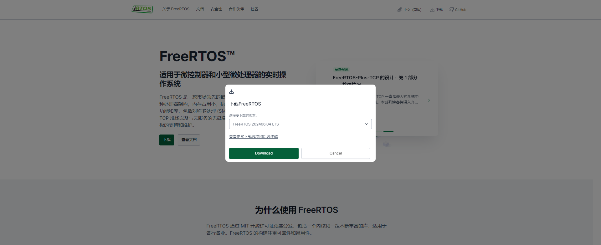

---

### 📁 制作移植模板文件夹

解压后来到目录：`…\FreeRTOSv202406.04-LTS\FreeRTOS-LTS\FreeRTOS\FreeRTOS-Kernel`

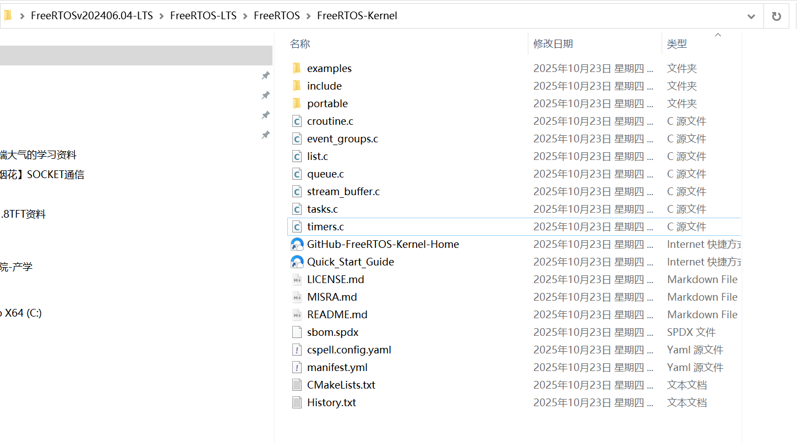

#### 核心文件说明

| 文件/文件夹名称 | 描述                                                |
| --------------- | --------------------------------------------------- |
| include         | 内包含了 FreeRTOS 的头文件                          |
| portable        | 包含 FreeRTOS 移植文件，与编译器相关、Keil 编译环境 |
| croutine.c      | 协程相关文件                                        |
| event_groups.c  | 事件相关文件                                        |
| list.c          | 列表相关文件                                        |
| queue.c         | 队列相关文件                                        |
| stream_buffer.c | 流式缓冲区相关文件                                  |
| tasks.c         | 任务相关文件                                        |
| timers.c        | 软件定时器相关文件                                  |

项目使用的是Keil，编译器属MDK，来到 `…\portable\Keil`，发现文件夹内容已经移动到 `...\portable\RVDS` 文件夹了。

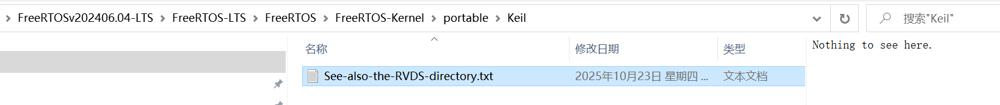

来到 `...\portable\RVDS\ARM_CM3`（本项目使用的STM32F103C8T6是ARM Cortex-M3内核，如果是其他内核的芯片就在 `portable` 文件夹找对应的移植文件）。这里存放的是与编译器和内核紧密相关的底层代码，主要包含 **port.c** 和 **portmacro.h** 两个关键文件，它们负责处理任务切换、中断进入/退出、堆栈初始化等与硬件直接交互的细节。

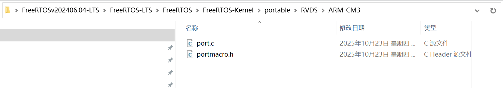

除此之外，在portable文件夹，我们还会用到 `…\portable\MemMang`，这里面放的是5种常用的内存算法，最常用的是 **内存算法4 (heap_4.c)**。

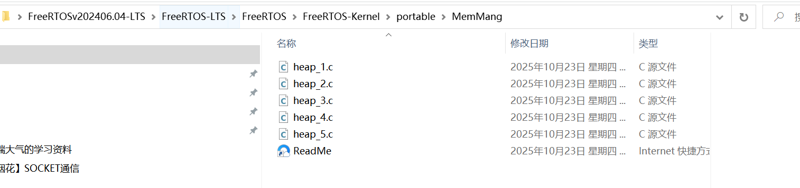

移植还需要配置文件 `FreeRTOSConfig.h`，可惜这个LTS版本里面好像并没有，至少我是没有找到。不过没有关系，来到FreeRTOS的官方仓库 [FreeRTOS/FreeRTOS](https://github.com/FreeRTOS/FreeRTOS/tree/main/FreeRTOS/Demo)，可以找到 **CORTEX_STM32F103_Keil** 示例工程文件夹，里面就有对应的 `FreeRTOSConfig.h`，点击Download raw file把文件下载下来。

关于这个配置文件文档里面有详细的说明:https://www.freertos.org/zh-cn-cmn-s/Documentation/02-Kernel/03-Supported-devices/02-Customization

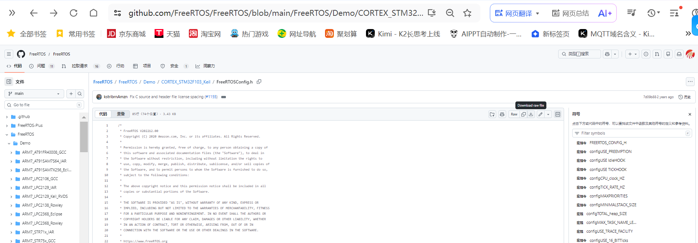

为了方便后面移植，俺新建了一个文件夹来把后续移植需要的文件单独贴了一份：

```
📦 STM32F103HAL库FreeRTOS移植模板
├── 📄 FreeRTOSConfig.h
├── 📁 include                (直接把官方的源码包的include文件夹粘过来)
├── 📁 portable
│   ├── 📁 MemMang
│   │   └── 📄 heap_4.c
│   └── 📁 RVDS
│       └── 📁 ARM_CM3
│           ├── 📄 port.c
│           └── 📄 portmacro.h
└── 📁 source
    ├── 📄 croutine.c
    ├── 📄 event_groups.c
    ├── 📄 list.c
    ├── 📄 queue.c
    ├── 📄 stream_buffer.c
    ├── 📄 tasks.c
    └── 📄 timers.c
```

---

### 🔧 移植FREERTOS到HAL库项目

#### STM32CubeMx创建Demo工程

我们先使用STM32CubeMx简单配置一个工程。

SYS菜单选择调试接口和时钟源（这里时钟源选择SysTick在引入FreeRTOS后是会有问题的，在后面的[⚠️ **HAL库和RTOS时钟源冲突问题**](#⚠️-hal库和rtos时钟源冲突问题)一节会做出说明）。

选择一个没有使用的定时器作为HAL库的时钟源

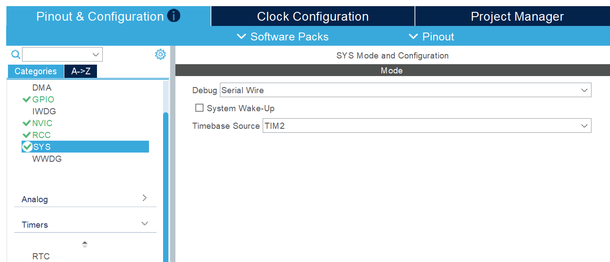

同时手动把时钟源的优先级改到1

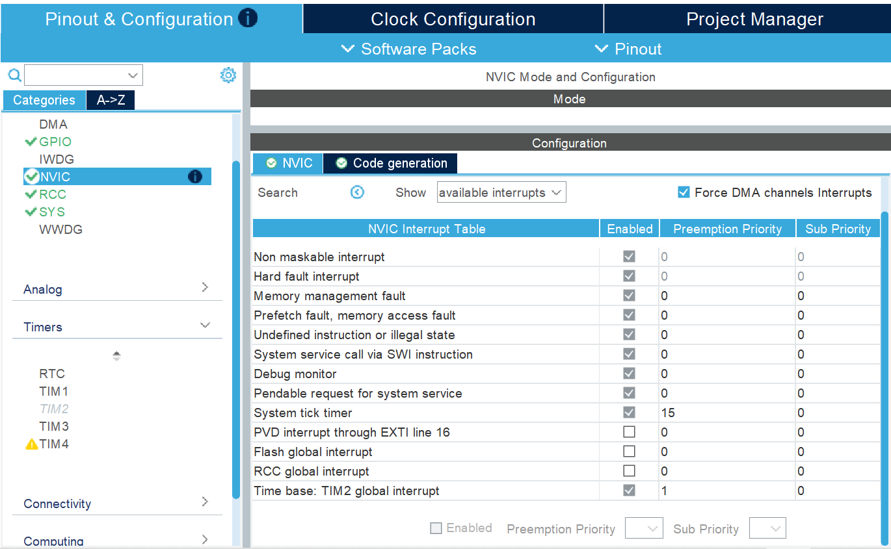

RCC菜单配置时钟源为高速外部晶振。

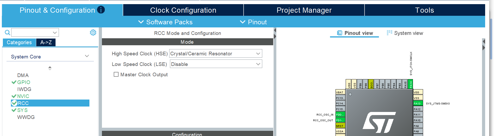

STM32F103最高支持72MHz系统时钟，我们需要通过PLL倍频达到这一频率，打开时钟树配置界面，直接把AHB总线时钟HCLK改为72MHz即可。

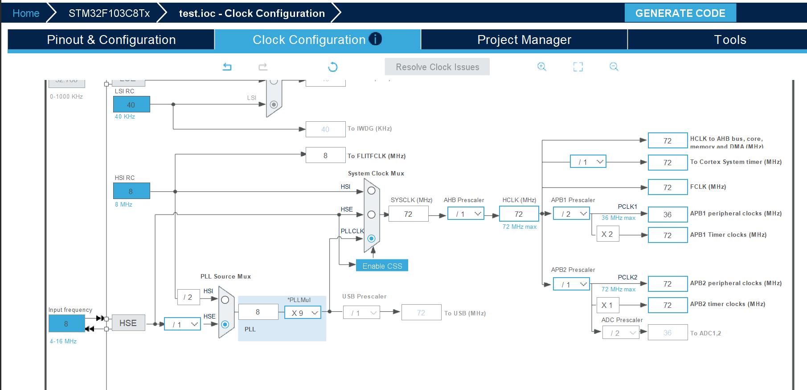

勾选为每个外设的初始化生成专门的.c和.h文件。

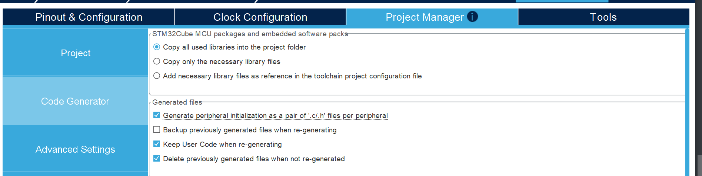

填写项目名和保存位置，选择工具链和版本（我使用的是Keil5）。

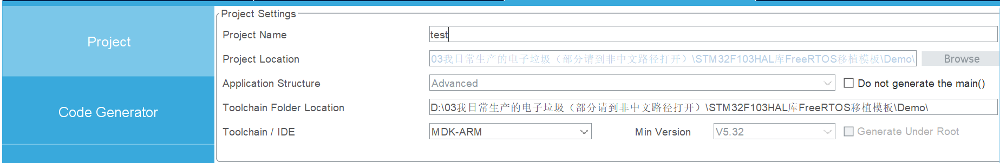

然后拉到最下面选择自己下载的固件包。

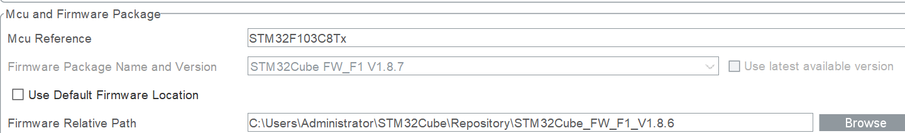

之后就可以点击**GENERRATE CODE**生成一个工程了。

#### 添加FreeRTOS源码到工程

更名我们的移植模板为FreeRTOS添加到工程文件夹，添加到工程目录，最好把配置文件剪切到Core/Inc（CubeMx生成的头文件都在这里），这样可以不必专门为单独的配置文件添加一条头文件路径。

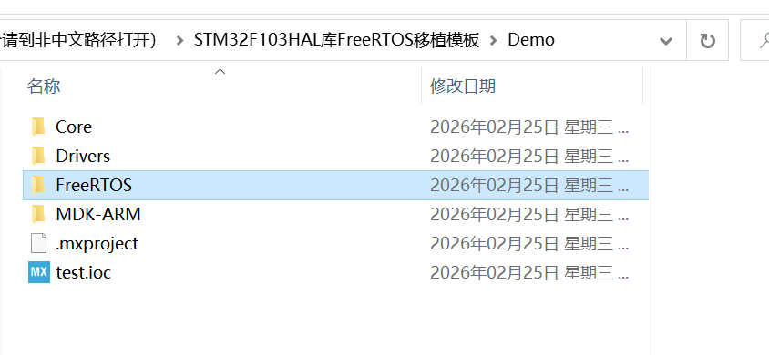

然后通过Keil打开项目，对工程添加FreeRTOS文件夹里的文件并包含include和portable文件夹最内层两个文件夹的路径。

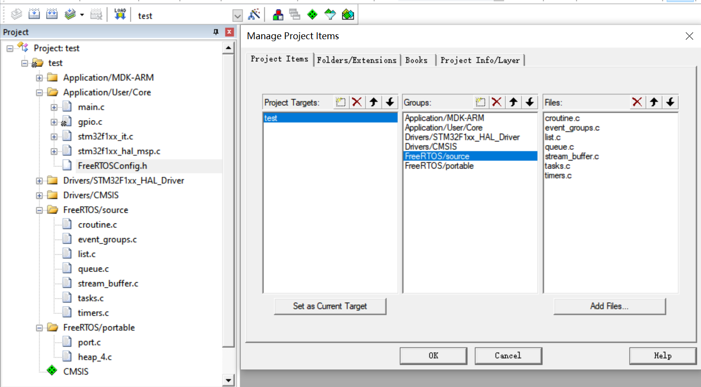

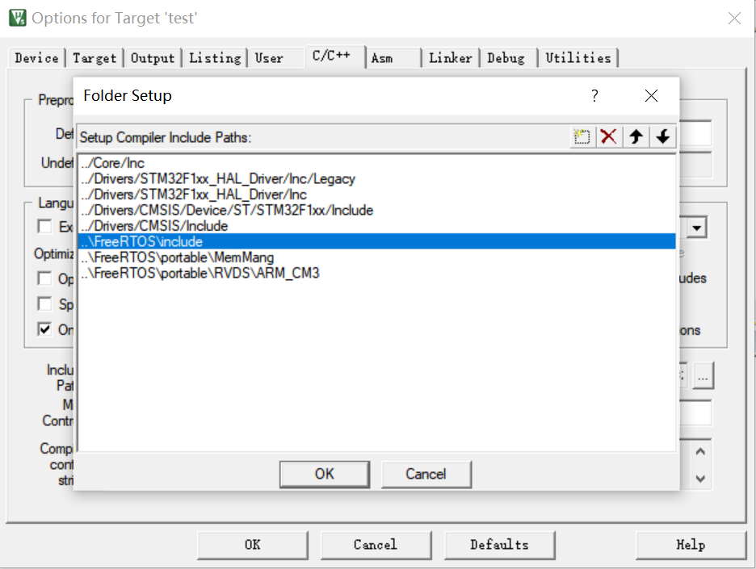

#### 针对HAL库+FreeRTOS添加三个宏

打开 `FreeRTOSConfig.h`，添加三个必要的宏：

```c
#ifndef FREERTOS_CONFIG_H
#define FREERTOS_CONFIG_H

// ... 原有配置 ...

// 添加三个宏
#define xPortPendSVHandler PendSV_Handler
#define vPortSVCHandler SVC_Handler
#define INCLUDE_xTaskGetSchedulerState 1

#endif /* FREERTOS_CONFIG_H */
```

此时编译会报错重复定义：

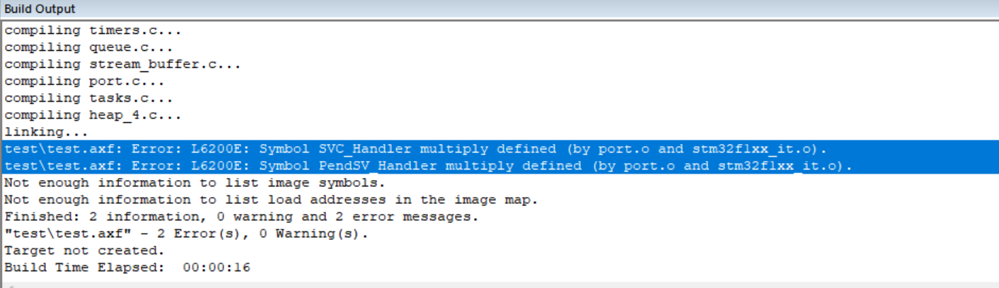

根据报错提示我们来到stm32f1xx_it.c，搜索一下这两个被重复定义的函数，注释掉即可：

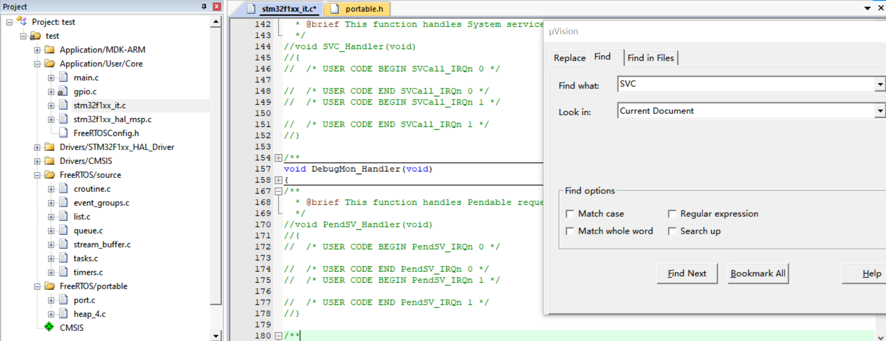

再次编译，就可以看到我们喜欢的**0Errors, 0Warnings**了！

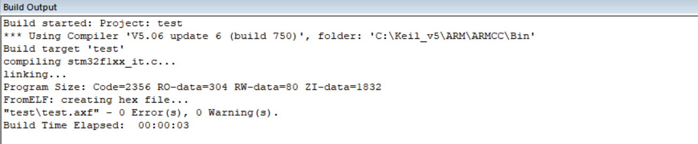

---

#### 🧠 为什么需要这三个宏？

添加这三个宏的核心原因在于 **HAL 库强制使用了 CMSIS 标准的中断命名**，而 FreeRTOS 的默认命名与它不匹配。具体来说：

STM32 上电后，CPU 首先执行的不是 C 代码，而是**启动文件**（`startup_stm32f103xe.s`）。

启动文件做了两件关键事：

1. 建立**中断向量表**，告诉CPU：“当中断X发生时，去执行函数Y”。
2. 调用 `SystemInit()`（HAL 库的时钟初始化），然后跳转到 `main()`。

**此时 FreeRTOS 还没开始运行，只有向量表是固定的。**

在启动文件里，中断向量表大概长这样：

```assembly
__Vectors
    DCD     __initial_sp            ; 栈顶指针
    DCD     Reset_Handler            ; 复位中断
    DCD     NMI_Handler              ; NMI
    DCD     HardFault_Handler        ; 硬错误
    ...
    DCD     SVC_Handler              ; SVC 中断 ← 固定名字
    ...
    DCD     PendSV_Handler           ; PendSV 中断 ← 固定名字
    ...
```

向量表里的名字是 **“写死的”**，不能改。

CPU 响应中断时，只会查这个表，找到对应的名字，然后跳转。

而FreeRTOS 的移植层（`port.c`）里，定义了它自己的中断处理函数：

```c
// 在 port.c 中
void xPortPendSVHandler(void)  { /* 任务切换代码 */ }
void vPortSVCHandler(void)     { /* 启动第一个任务的代码 */ }
```

**问题来了**：  
CPU 在 PendSV 中断发生时，找的是 `PendSV_Handler`（向量表里的名字）。

PendSV中断是用于任务切换的，主要作用就是保存当前任务的状态、恢复下一个任务的状态。

但 FreeRTOS 提供的是 `xPortPendSVHandler`。

名字对不上 → CPU 找不到人 → 系统崩溃。

而定义宏的作用就是建立 **“名字映射”**：

在 `FreeRTOSConfig.h` 里写：

```c
#define xPortPendSVHandler PendSV_Handler
#define vPortSVCHandler    SVC_Handler
```

这里定义宏的本质不是“改名”，而是**编译时的符号替换**。

预处理器会把代码中所有的 `xPortPendSVHandler` 替换成 `PendSV_Handler`。

所以 FreeRTOS 编译后，它的 PendSV 函数实际叫 **`PendSV_Handler`**，正好对上向量表。

**此时的关系**：

```
向量表说：PendSV 中断 → 找 PendSV_Handler
                      ↓
实际存在：PendSV_Handler 就是 FreeRTOS 的 xPortPendSVHandler
                      ↓
完美对接，任务切换正常
```

就比如写了这样一段代码：

```c
// FreeRTOS 源码里定义了一个函数
void xPortPendSVHandler(void) {
    // 这里是一大堆任务切换的代码
    // 保存寄存器、切换栈、恢复下一个任务...
}
```

如果没有宏，编译后这个函数的名字就是 **`xPortPendSVHandler`**。

但是加上宏之后：

```c
#define xPortPendSVHandler PendSV_Handler
```

编译器在编译时，把所有 `xPortPendSVHandler` **替换成** `PendSV_Handler`。

---

除了上面两个宏是必须添加的以外，对于 `INCLUDE_xTaskGetSchedulerState`，它可以看作是获取调度器状态的函数开关。

FreeRTOS 的源码里到处都是 `#ifdef INCLUDE_xxx`：

```c
// 在 tasks.c 中
#if ( INCLUDE_xTaskGetSchedulerState == 1 )
    TaskSchedulerState_t xTaskGetSchedulerState( void )
    {
        /* 函数体 */
    }
#endif
```

如果 **没定义** `INCLUDE_xTaskGetSchedulerState 1`，这段代码**根本不会被编译**。

但如果你在别处（比如 HAL 库的某个中间件）调用了 `xTaskGetSchedulerState()`，链接器就会报错：**“这个函数不存在！”**

**它的关系是**：  
不涉及中断，只涉及**编译链接**。

它是 FreeRTOS 的“功能开关”之一，让你按需裁减代码大小。

---

**总结一下**：

| 宏                               | 触发阶段         | 作用对象        | 解决什么问题                        |
| -------------------------------- | ---------------- | --------------- | ----------------------------------- |
| `xPortPendSVHandler`             | **中断发生时**   | CPU + 向量表    | 让 CPU 能找到 PendSV 中断处理函数   |
| `vPortSVCHandler`                | **启动调度器时** | CPU + 向量表    | 让 CPU 能找到 SVC 中断处理函数      |
| `INCLUDE_xTaskGetSchedulerState` | **编译链接时**   | 编译器 + 链接器 | 让需要的 API 函数被编译进最终二进制 |

---

#### FreeRTOS 系统心跳中断集成

在stm32f1xx_it.c文件中添加修改以下部分（**注意两个头文件顺序不能换否则报错**）：

```c
/* USER CODE BEGIN Includes */
#include "FreeRTOS.h"
#include "task.h"
/* USER CODE END Includes */

/* USER CODE BEGIN PFP */
extern void xPortSysTickHandler(void);
/* USER CODE END PFP */

void SysTick_Handler(void)
{
  /* USER CODE BEGIN SysTick_IRQn 0 */

  /* USER CODE END SysTick_IRQn 0 */

  /* USER CODE BEGIN SysTick_IRQn 1 */
    if (xTaskGetSchedulerState() != taskSCHEDULER_NOT_STARTED)
	{
			xPortSysTickHandler();
	}
  /* USER CODE END SysTick_IRQn 1 */
}
```

#### 🔄 FreeRTOS 系统心跳中断在不同调度器状态下的行为流程图

**场景1：系统刚启动，调度器还没运行**

```
时间轴：
1. 系统复位
2. 时钟初始化完成
3. SysTick定时器开始工作（每1ms中断一次）
4. 但 vTaskStartScheduler() 还没调用
   ↓
   xTaskGetSchedulerState() = taskSCHEDULER_NOT_STARTED
   ↓
   if 条件不成立 → 跳过 xPortSysTickHandler()
   ↓
   安全！不会在调度器未就绪时乱动内部数据结构
```

**场景2：调度器已启动，正常运行**

```
时间轴：
1. vTaskStartScheduler() 已调用
2. 调度器状态 = taskSCHEDULER_RUNNING
3. 每1ms SysTick中断发生
   ↓
   if 条件成立 → 调用 xPortSysTickHandler()
   ↓
   xPortSysTickHandler() 内部：
      - 更新系统 tick 计数 (xTickCount++)
      - 检查是否有延时的任务到期
      - 如果需要切换任务，触发 PendSV 中断
   ↓
   任务调度正常工作
```

**场景3：调度器被暂停**

```c
vTaskSuspendAll();  // 暂时挂起调度器
// 此时调度器状态 = taskSCHEDULER_SUSPENDED
```

```
SysTick中断发生时：
   if 条件成立（因为 != NOT_STARTED）
   ↓
   调用 xPortSysTickHandler()
   ↓
   tick计数继续更新（时间还在走）
   ↓
   但不会触发任务切换（挂起期间禁止切换）
   ↓
   xTaskResumeAll() 后恢复正常
```

---

#### ⚠️ HAL库和RTOS时钟源冲突问题

在FreeRTOS系统中，SysTick定时器被配置为提供系统心跳节拍，而PendSV中断则负责执行实际的任务切换。为了保证系统的实时性和任务调度的正确性，FreeRTOS会将**SysTick和PendSV的中断优先级均设置为最低（通常为15）**，确保它们不会抢占其他高优先级的中断服务例程。

然而，这种设计引入了一个潜在问题：**HAL_Delay()函数依赖于SysTick中断来更新其时间计数**。当在**优先级高于SysTick的中断服务函数**中调用HAL_Delay()时，由于该中断的优先级更高，SysTick中断无法抢占执行，导致HAL_Delay()无法获得时间更新，从而陷入**死循环**。此时系统看似卡死，实则是高优先级中断一直在等待永远不会发生的SysTick中断。

简单的解决办法就是

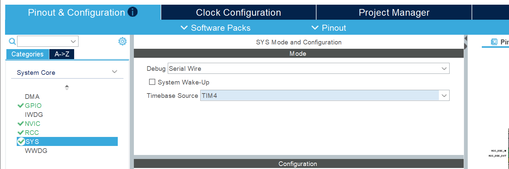

同时手动把时钟源的优先级改到1

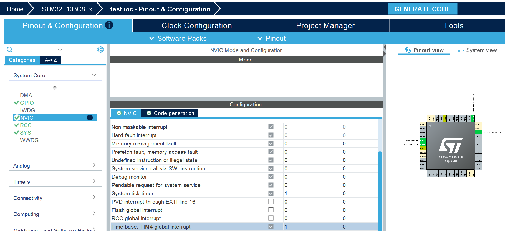

#### 🧠 Cortex-M3的中断机制

这里可以温习一下Cortex-M3的工作机制：

STM32F103是单核Cortex-M3，物理上不可能同时执行两段代码。无论有多少个中断挂起，CPU在任一时刻只能执行其中一个ISR。虽然一次只能执行一个，但高优先级中断可以打断低优先级中断的执行。

```
挂起的中断队列：
┌─────────┬─────────┬─────────┐
│ IRQ5    │ IRQ3    │ IRQ1    │  ← 多个中断同时发生
│ (pri:1) │ (pri:2) │ (pri:3) │
└─────────┴─────────┴─────────┘
    ↓
NVIC挑选优先级最高的
    ↓
┌─────────┐
│ 执行IRQ5 │  ← CPU只执行这一个
└─────────┘
    ↓
IRQ5执行完，NVIC再挑下一个
```

这就是为什么在CubeMX配置时，SYS菜单下时钟源选择SysTick会存在问题。在引入FreeRTOS后，我们需要**将时钟源从SysTick改为TIM1或其他硬件定时器**，让SysTick完全由FreeRTOS接管，而HAL库的时基则使用另一个独立的硬件定时器，从根本上解决冲突问题。

---

#### 移植测试程序

PB8和PB9是我后面给OLED显示屏的，这里提前配置好了，我的本意也是用OLED测试的但是死活没有发现问题又开了这个板载小灯，至于为啥没发现问题请开下一节。

不过事已至此，测试测序还是用核心板板载小灯好了。用CUBEMX配置一下PC13,这个引脚连接的就是板载小灯。

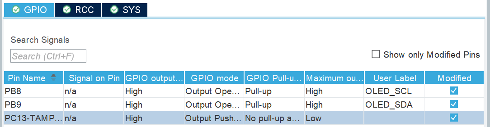

由于代码不多就直接在main.c测试好了

测试功能是创建一个动态任务，打开文档

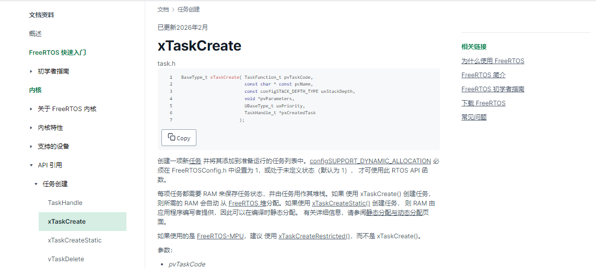

###### FreeRTOSConfig.h

根据文档首先我们要求FreeRTOSConfig.h里面添加对应的宏

```c
#define configSUPPORT_DYNAMIC_ALLOCATION    1  // 支持动态内存分配
```

###### main.c

然后来到main.c,添以下代码

```c
/* USER CODE BEGIN Includes */
#include "FreeRTOS.h"
#include "task.h"
/* USER CODE END Includes */

/* USER CODE BEGIN PV */
// 定义任务句柄
TaskHandle_t xLEDBlinkTaskHandle;
/* USER CODE END PV */

/* USER CODE BEGIN 0 */
// LED闪烁任务函数 - 使用已配置的PC13
void Task_LED_Blink(void * pvParameters)
{
    while(1)
    {
        // 点亮LED
        HAL_GPIO_WritePin(GPIOC, GPIO_PIN_13, GPIO_PIN_RESET);  // 低电平点亮
        vTaskDelay(500);  // 延时500ms
        
        // 熄灭LED
        HAL_GPIO_WritePin(GPIOC, GPIO_PIN_13, GPIO_PIN_SET);    // 高电平熄灭
        vTaskDelay(500);  // 延时500ms
    }
}

// 创建LED闪烁任务
void Create_LED_Blink_Task(void)
{
    HAL_GPIO_WritePin(GPIOC, GPIO_PIN_13, GPIO_PIN_RESET);  // 低电平点亮
	  HAL_Delay(100);
    xTaskCreate(
        (TaskFunction_t)Task_LED_Blink,             // 任务函数
        (char *)"LED",                 // 任务名称
        (configSTACK_DEPTH_TYPE)128,                         // 堆栈大小(字)
        (void *)NULL,                        // 任务参数
        (UBaseType_t)1,                           // 任务优先级（比动画任务低）
        (TaskHandle_t *)&xLEDBlinkTaskHandle);         // 任务句柄
}

/* USER CODE END 0 */

/* USER CODE BEGIN 2 */
// 创建测试任务（小灯闪烁）
Create_LED_Blink_Task();        

// 启动调度器
vTaskStartScheduler();

/* USER CODE END 2 */
```

###### 预期现象

运行下载后板载小灯闪烁说明程序正常。

#### ！！这个时候我才发现我用的是C6T6芯片

到上面这一步C8T6的移植就可以结束了。

但这个时候我遇到一个奇葩问题，我一开始用的是TIM4来当HAL库时基源的时候，发现HAL_Delay()直接罢工，任务调度器也开不了，直到晚上突然想起前阵子某天在帖子里面问为啥我的串口3死活用不了，翻出来看到有人回了我一句看看芯片是C8T6还是C6T6。我才意识到，好家伙，打着电筒放大好几倍才发现丝印写的是C6T6的芯片哈哈哈。

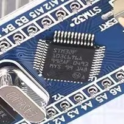

我看ST论坛上有说法是这样的，这里面的对比点，反正串口3（之前拉满了想开第三个串口结果发现串口3引脚始终高电平用不了）、TIM4（这次）、I2C2(之前硬件I2CMPU6050)的坑我都已经栽过了，哎，怪我眼神差，我回头才发现购买的时候后面备注是C6T6芯片！

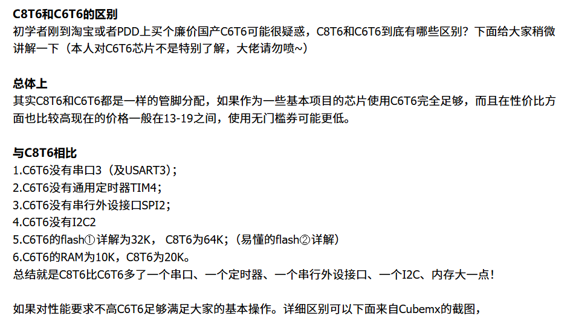

欸，那为啥C8T6的程序能正常下载到C6T6芯片里呢，大概是因为：

内核完全相同：都是Cortex-M3，指令集、寄存器映射、NVIC中断控制器完全一致 ；

引脚封装兼容：都是LQFP48封装，引脚排列一模一样 ；

基础外设相同：GPIO、TIM1/2/3、USART1/2、SPI1、I2C1、ADC等都一样 ；

存储器映射相同：Flash和SRAM的起始地址相同，只是容量减半 ；

调试接口相同：SWD/JTAG接口完全一致……

我看论坛上有个说法是C6T6就是阉割的C8T6哈哈哈哈

那……我把芯片换到C6T6试试好了

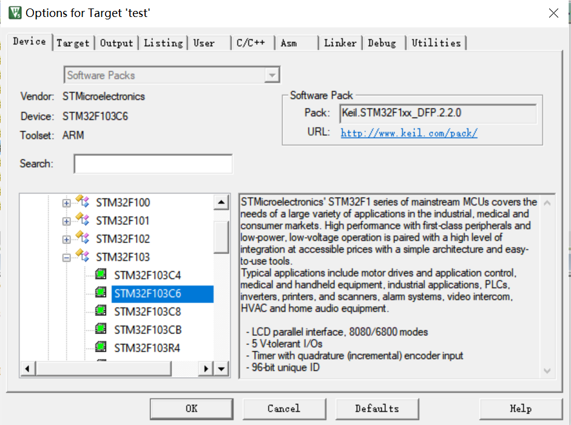

然后我就发现报错了，这个内存它炸开了

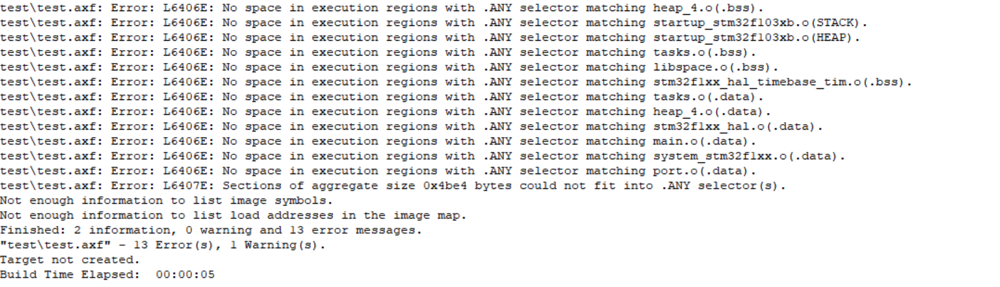

啥原因呢？问题出在FreeRTOS这个配置文件，上面ST论坛也说了**STM32F103C6T6 的 RAM 只有 10KB**，从官方拿来的配置文件大方给FreeRTOS的堆内存分了17KB，比总内存都大了，我们把它修改到4KB

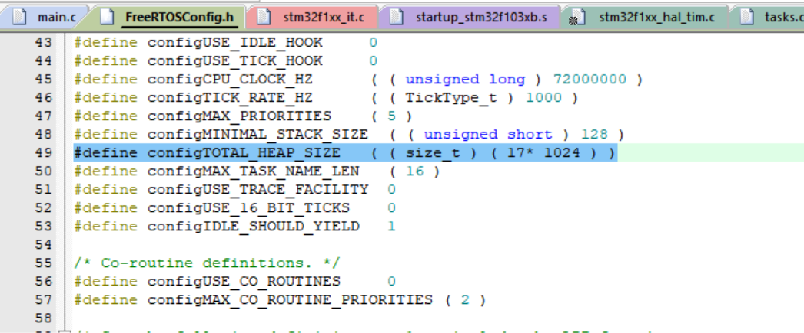

这回就对了，害

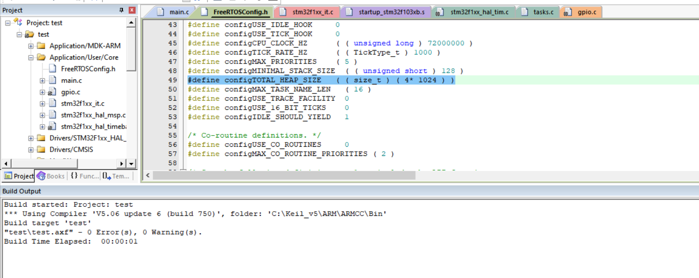

至于STM32CUBEMX修改芯片，右键通过Code打开（记事本也可以）

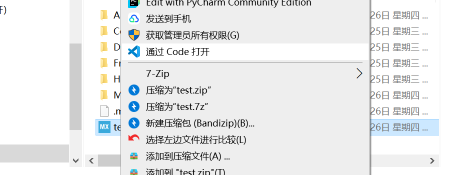

修改下面的部分：

```
# 原配置 (C8T6)
Mcu.Name=STM32F103C(8-B)Tx
Mcu.UserName=STM32F103C8Tx
PCC.MCU=STM32F103C(8-B)Tx
PCC.PartNumber=STM32F103C8Tx
ProjectManager.DeviceId=STM32F103C8Tx

# 改为 (C6T6)
Mcu.Name=STM32F103C(6-8)Tx    ; C6T6 也在这个系列
Mcu.UserName=STM32F103C6Tx
PCC.MCU=STM32F103C(6-8)Tx
PCC.PartNumber=STM32F103C6Tx
ProjectManager.DeviceId=STM32F103C6Tx
```

然后重新打开.ioc，非常完美，改好了，而且通过图形界面我们也可以看到C6T6是没有TIM4资源的，解释了上面的问题。至于这样改，反正C6T6可以兼容我们之前的所有配置，重新生成一下工程到Keil就OK了

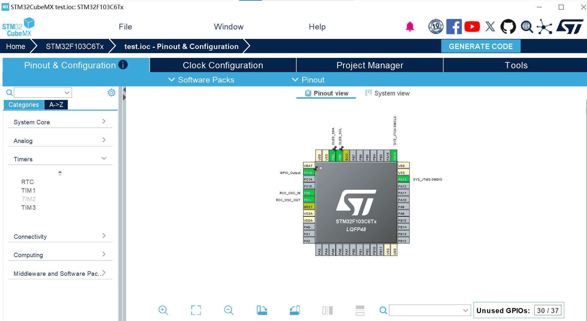

## ⚙️ 硬件驱动库（HardWare文件夹）

#### OLED显示屏

这部分移植的是江协科技0.96寸OLED显示屏教程的部分代码

##### CUBEMX配置GPIO初始化部分

首先是原来MyIIC的初始化部分我们可以直接通过STM32CUBEMX配置，这里是软件模拟IIC

标准库中:

```c
//I2C初始化
void MyI2C_Init(void)
{
    RCC_APB2PeriphClockCmd(RCC_APB2Periph_GPIOB, ENABLE);  // 使能GPIOB时钟
    
    GPIO_InitTypeDef GPIO_InitStructure;
    GPIO_InitStructure.GPIO_Mode = GPIO_Mode_Out_OD;       // 开漏输出模式(配合外部上拉电阻实现线与功能）
    GPIO_InitStructure.GPIO_Pin = GPIO_Pin_8 | GPIO_Pin_9;
    GPIO_InitStructure.GPIO_Speed = GPIO_Speed_50MHz;       // 50MHz速度
    GPIO_Init(GPIOB, &GPIO_InitStructure);
    
    GPIO_SetBits(GPIOB, GPIO_Pin_8 | GPIO_Pin_9);           // 初始化为高电平
}
```

对于到CUBEMX就是

```
点击引脚选择GPIO_OUTPUT
配置选项
GPIO output level:   [High]     ← 对应 GPIO_SetBits(高电平)
GPIO mode:           [Output Open Drain]  ← 对应 GPIO_Mode_Out_OD
GPIO Pull-up/Pull-down: [No pull-up and no pull-down] ← 无上拉/下拉（外部已有上拉电阻）
Maximum output speed: [High]    ← 对应 GPIO_Speed_50MHz
User Label:          [OLED_SCL](PB8)/[OLED_SDA](PB9)
```

生成工程后这部分初始化内容会放到MX_GPIO_Init()函数中执行

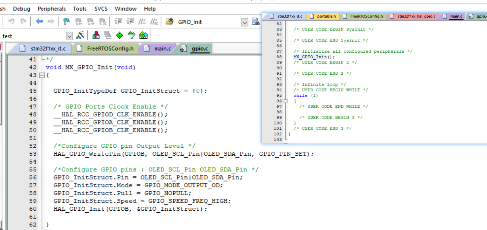

##### 软件I2C驱动文件

然后是原来软件IIC文件MYI2C剩余的代码，只需要修改最底层的3个引脚读写函数为HAL库自己的引脚读写函数，上层的I2C时序逻辑完全不需要动。

###### MYI2C_HAL.h

```c
#ifndef __MYI2C_HAL_H
#define __MYI2C_HAL_H

#include "main.h"

//所以函数声明

#endif
```

###### MYI2C_HAL.c

```c
#include "MYI2C_HAL.h"

// 定义引脚
#define OLED_SCL_PIN GPIO_PIN_8
#define OLED_SDA_PIN GPIO_PIN_9
#define OLED_GPIO_PORT GPIOB

// 写SCL引脚电平 (HAL库版本)
void MyI2C_W_SCL(uint8_t BitValue)
{
    HAL_GPIO_WritePin(OLED_GPIO_PORT, OLED_SCL_PIN, 
                      (GPIO_PinState)BitValue);
}

// 写SDA引脚电平 (HAL库版本)
void MyI2C_W_SDA(uint8_t BitValue)
{
    HAL_GPIO_WritePin(OLED_GPIO_PORT, OLED_SDA_PIN, 
                      (GPIO_PinState)BitValue);
}

// 读SDA引脚电平 (HAL库版本)
uint8_t MyI2C_R_SDA(void)
{
    return HAL_GPIO_ReadPin(OLED_GPIO_PORT, OLED_SDA_PIN);
}

// I2C初始化
void MyI2C_Init(void)
{
    // CubeMX已经初始化了GPIO
    MyI2C_W_SCL(1);
    MyI2C_W_SDA(1);
}


// 起始信号、停止信号、发送字节、接收字节、发送应答、接收应答这些时序控制逻辑的函数直接照搬就好


```

##### OLED驱动文件

江协科技里面的OLED.c和OLED.h都是基于软件模拟IIC写的

由于原来的代码比较长尤其是字模定义会占据较大的篇幅，我们可以把字模数据单独划出去，这样OLED的驱动被拆分为两组文件

```
📁 HardWare
├── 📄 oled_fonts.h      ← 字模声明
├── 📄 oled_fonts.c      ← 字模数据
├── 📄 oled.h            ← OLED函数声明 + 显示缓存
├── 📄 oled.c            ← OLED函数实现
└── 其他硬件驱动文件……
```

###### oled_fonts.h

```c
#ifndef __OLED_FONTS_H
#define __OLED_FONTS_H

#include <stdint.h>

// 字模声明
extern const uint8_t OLED_F8x16[][16];
extern const uint8_t OLED_F6x8[][6];

// 汉字结构
typedef struct {
    char Index[4];
    uint8_t Data[32];
} ChineseCell_t;

extern const ChineseCell_t OLED_CF16x16[];

#endif
```

###### **oled_fonts.c**

```c
#include "oled_fonts.h"

// 你的字模数据（完全复制过来）
const uint8_t OLED_F8x16[][16] = {
    // ... 原字模数据 ...
};

const uint8_t OLED_F6x8[][6] = {
    // ... 原字模数据 ...
};

const ChineseCell_t OLED_CF16x16[] = {
    // ... 原字模数据 ...
};
```

编译后报错，大概是中文字符解析的问题

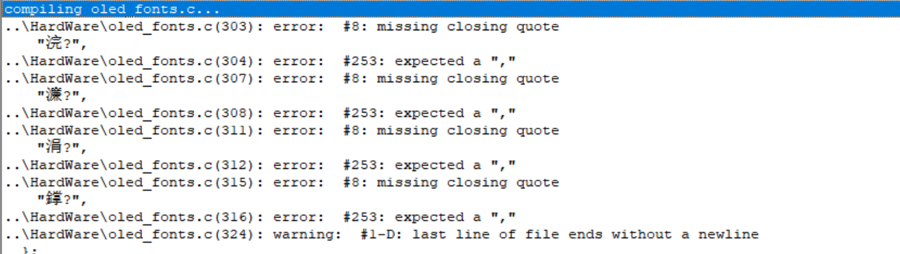

打开魔术棒C/C++选项卡

在Misc Control栏添加然后重新编译就不会报错了

```
--no-multibyte-chars
```

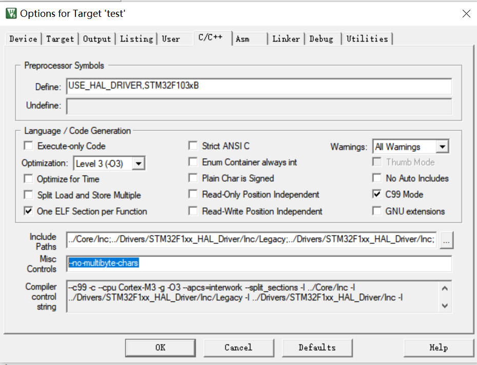

至于屏幕驱动的两个文件基本就照搬标准库的实现的改改头文件就行了（我在江协科技OLED教程的基础上添加了一些基本的显示实现）

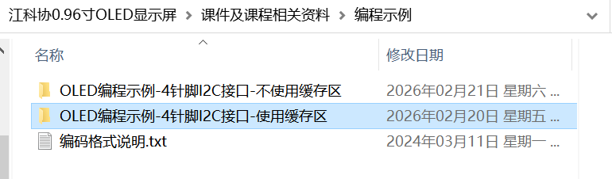

不过注意延时函数江协用的是自写的Delay.c，我们可以打开看看它的实现。注意到延时函数用的是直接操作SysTick的方法,但是FreeRTOS也在用SysTick,有冲突风险，这里我们可以使用一个HAL_Delay()替代。当然也可以用简单的循环实现。

```c
for(volatile uint32_t i = 0; i < 100000; i++); 
```

```c
//江协科技原来的延时函数
void Delay_us(uint32_t xus)
{
	SysTick->LOAD = 72 * xus;   // 重新配置SysTick！⚠️ 这是大问题
	SysTick->VAL = 0x00;
	SysTick->CTRL = 0x00000005; // 启动定时器
	while(!(SysTick->CTRL & 0x00010000));
	SysTick->CTRL = 0x00000004; // 关闭定时器
}
```

###### OLED.h

```c
#ifndef __OLED_H
#define __OLED_H

#include <stdint.h>


// 显示缓存
extern uint8_t OLED_DisplayBuf[8][128];

//==============================================================================
// 基础操作函数
//==============================================================================

// OLED_Init - OLED初始化
void OLED_Init(void);

// OLED_WriteCommand - 写命令到OLED
void OLED_WriteCommand(uint8_t Command);

// OLED_WriteData - 写数据到OLED
void OLED_WriteData(uint8_t *Data, uint8_t Count);

// OLED_SetCursor - 设置光标位置
void OLED_SetCursor(uint8_t X, uint8_t Page);

// OLED_Update - 更新显示（将显存内容发送到OLED）
void OLED_Update(void);

// OLED_Clear - 清空整个屏幕
void OLED_Clear(void);

// OLED_ClearArea - 清空指定区域
void OLED_ClearArea(uint8_t X, uint8_t Y, uint8_t Width, uint8_t Height);

// OLED_Reverse - 整个屏幕反色
void OLED_Reverse(void);

// OLED_ReverseArea - 指定区域反色
void OLED_ReverseArea(int16_t X, int16_t Y, uint8_t Width, uint8_t Height);

// OLED_ShowChar - 显示单个字符
void OLED_ShowChar(uint8_t X, uint8_t Y, char Char, uint8_t Fontsize);

// OLED_ShowString - 显示字符串
void OLED_ShowString(uint8_t X, uint8_t Y, char *String, uint8_t FontSize);

// OLED_ShowImage - 显示图像
void OLED_ShowImage(uint8_t X, uint8_t Y, uint8_t Width, uint8_t Height, const uint8_t *Image);

// OLED_ShowChinese - 显示汉字
void OLED_ShowChinese(uint8_t X, uint8_t Y, char *Chinese);

// OLED_DrawPoint - 画点
void OLED_DrawPoint(uint8_t X, uint8_t Y);

// OLED_GetPoint - 获取点状态（是否点亮）
uint8_t OLED_GetPoint(uint8_t X, uint8_t Y);

//==============================================================================
// 显示设置函数
//==============================================================================

// OLED_DisplayOn - 打开OLED显示
void OLED_DisplayOn(void);

// OLED_DisplayOff - 关闭OLED显示
void OLED_DisplayOff(void);

// OLED_SetContrast - 设置对比度
void OLED_SetContrast(uint8_t contrast);

// OLED_SetDisplayMode - 设置显示模式（正常/反色）
void OLED_SetDisplayMode(uint8_t isInverse);

//==============================================================================
// 区域操作函数
//==============================================================================

// OLED_FillArea - 填充指定区域
void OLED_FillArea(uint8_t X, uint8_t Y, uint8_t Width, uint8_t Height, uint8_t data);

// OLED_DrawRectangle - 绘制矩形（空心/填充）
void OLED_DrawRectangle(uint8_t X, uint8_t Y, uint8_t Width, uint8_t Height, uint8_t isFill);

// OLED_DrawLine - 绘制直线
void OLED_DrawLine(uint8_t X1, uint8_t Y1, uint8_t X2, uint8_t Y2);

//==============================================================================
// 字符串操作增强函数
//==============================================================================

// OLED_ShowString_Center - 居中显示字符串
void OLED_ShowString_Center(uint8_t Y, char *String, uint8_t FontSize);

// OLED_ShowString_Right - 右对齐显示字符串
void OLED_ShowString_Right(uint8_t X, uint8_t Y, char *String, uint8_t FontSize);

//==============================================================================
// 数字显示函数
//==============================================================================

// OLED_ShowNum - 显示无符号整数
void OLED_ShowNum(uint8_t X, uint8_t Y, uint32_t num, uint8_t len, uint8_t FontSize);

// OLED_ShowSignedNum - 显示有符号整数
void OLED_ShowSignedNum(uint8_t X, uint8_t Y, int32_t num, uint8_t len, uint8_t FontSize);

// OLED_ShowHexNum - 显示十六进制数
void OLED_ShowHexNum(uint8_t X, uint8_t Y, uint32_t num, uint8_t len, uint8_t FontSize);

// OLED_ShowBinNum - 显示二进制数
void OLED_ShowBinNum(uint8_t X, uint8_t Y, uint32_t num, uint8_t len, uint8_t FontSize);

// OLED_ShowFloatNum - 显示浮点数
void OLED_ShowFloatNum(uint8_t X, uint8_t Y, float num, uint8_t intLen, uint8_t floatLen, uint8_t FontSize);

//==============================================================================
// 滚动效果函数
//==============================================================================

// OLED_ScrollString - 滚动显示字符串
void OLED_ScrollString(uint8_t Y, char *String, uint8_t FontSize, uint16_t delay, uint8_t direction);

// pow_int函数声明 - 辅助函数
double pow_int(double x, int y);

#endif  
```

###### OLED.c

```c
#include "oled.h"
#include "oled_fonts.h"
#include "myi2c_hal.h"
#include <string.h>
#include "FreeRTOS.h"   // 必须放在task.h前面
#include "task.h"        

// 显示缓存（定义）
uint8_t OLED_DisplayBuf[8][128];

//照搬原来的写数据、写命令时序函数即可

//OLED初始化
void OLED_Init(void)
{
	MyI2C_Init();
	//……照搬
}

//各种屏幕操作函数实现详见OLED.C
```

#### RTC时钟

之前笔者是用外挂DS1302芯片来做的时钟功能，但STM32微控制器内部其实已经集成了RTC（Real-Time Clock）外设。智能手表对功耗和体积的严格要求，利用VBAT引脚接备用电池保证主电源掉电时持续计时，配合外部32.768kHz晶振（LSE）确保精度，再结合FreeRTOS的Tickless模式实现深度睡眠下的定时唤醒，这样既能精简硬件、降低成本，又能利用RTC闹钟实现定时提醒等智能功能，更符合智能手表的量产思维。

代码还是从江协科技32标准库教程移植过来，参考12-2RTC实时时钟示例程序。

##### CUBEMX配置

首先打开STM32F103的数据手册，可以看到，在STM32的时钟树结构中，RTC（实时时钟）模块的时钟源RTCCLK可通过三条路径获取：LSE（低速外部晶振）、LSI（低速内部RC振荡器）以及HSE（高速外部时钟）的分频输出。其中，LSE采用32.768 kHz的外部晶振具有独特的工程优势：该频率经过15次二分频后恰好可获得精准的1Hz秒信号，且晶振本身具有极低的功耗特性。更为关键的是，在电源管理架构中，LSE所在的低速时钟域与VBAT备用电源域直接相连——当主电源VDD掉电时，VBAT引脚连接的纽扣电池或超级电容能够无缝接管LSE振荡器及RTC寄存器的供电，确保实时时钟在系统休眠或断电状态下仍能持续运行并保持时间数据不丢失。相比之下，LSI虽然无需外部器件，但其精度受温度影响较大且无法由备用电池供电；HSE路径则因依赖于主电源供电的主振荡器，在掉电后完全失效。因此，从工程可靠性角度出发，选择LSE作为RTC时钟源是实现主备电源无缝切换、保障低功耗模式下时钟持续运行的唯一合理方案。

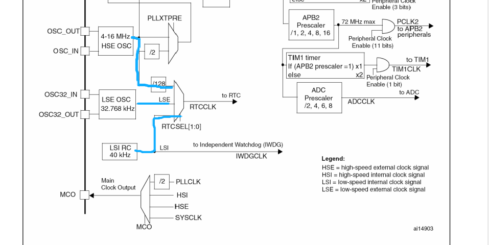

所以我们要在CUBEMX里面启用LSE

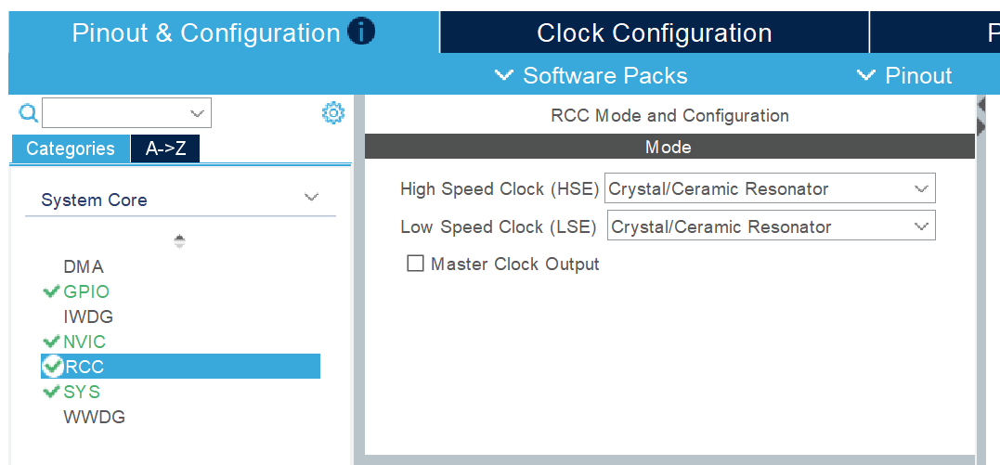

然后来到RTC配置界面，特别注意：

**RTC输出引脚默认与板载LED的PC13复用**，如果在RTC配置界面不需要使用输出功能，千万不要选择"Disable"，而是必须选择"NO RTC OUTPUT"。因为选择"Disable"实际上并没有真正禁用RTC输出，反而会强制要求你在下方的三种输出模式中选择一种，这样RTC就会持续占用PC13引脚输出时钟信号，导致原本应该由代码控制的板载LED不受控制地变成常亮状态（笔者实践的血泪都是哈哈，这个Disable太有迷惑性了）；只有选择"NO RTC OUTPUT"，才能真正释放PC13引脚的控制权，让LED可以按照预期正常闪烁。

```
☑ Activate Clock Source    （勾选 - 使能RTC时钟）
☑ Activate Calendar        （勾选 - 使能日历功能）
RTC OUT → NO RTC OUTPUT     （释放RTC输出引脚为普通GPIO引脚）
Tamper → Disable           （禁用入侵检测）
```

下面日历时间配置这里，对于日期格式（Data Format），两种格式都可，Binary数值直接以二进制形式存储,而BCD每个十进制位用4位二进制表示

```
例子：15点58分
Binary：Hours  = 15  → 二进制：0000 1111
        Minutes= 58  → 二进制：0011 1010
BCD:    Hours  = 15  → 高4位=1，低4位=5 → 二进制：0001 0101
        Minutes= 58  → 高4位=5，低4位=8 → 二进制：0101 1000
```

选择不同的日期格式后续代码写的会不大一样，举例说

```
Binary方式：
sTime.Hours = 15;     // 直接赋值为15
sTime.Minutes = 58;   // 直接赋值为58
BCD方式：
sTime.Hours = 0x15;   // 需要写成0x15，实际代表15点
sTime.Minutes = 0x58; // 需要写成0x58，实际代表58分
```

按照江协代码的写法那就是Binary方式。

然后其他的年月日包括后面的日期配置的初始值都不用在这里设置，这些我们留到代码去写HAL库自带的时间结构体就好。

生成的代码中可以看到CUBEMX自动帮我们生成了时间相关的结构体

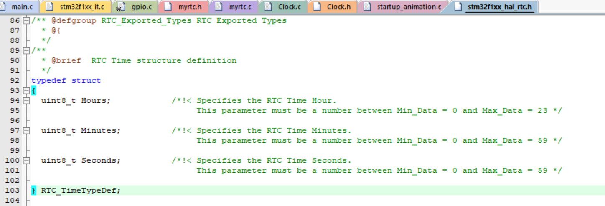

后续我们可以在自动生成的rtc.c中找到设置初始时间的代码片段

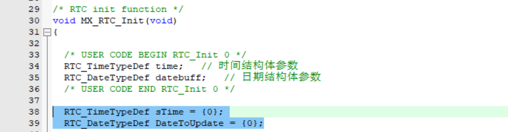

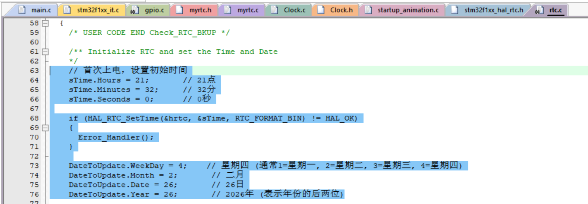

CUBEMX会默认把我们在Calendar Time/Date里面设置的初始时间放到这里，我们只需要修改代码就可以覆盖原先的设置

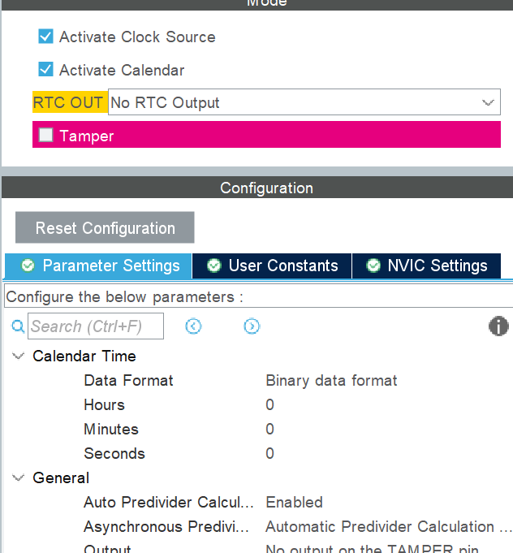

通用配置General这里

```
Auto Predivider Calculation

要不要自动计算分频？ → 选 Enabled（开启）

Asynchronous Predivider value

怎么计算分频？ → 选 Automatic（自动）
```

这样CUBEMX就自动帮我们把分频配好了，相当于原来我们手动配置预分配器这一步

```
//配置预分配器
RTC_SetPrescaler(32768-1);
RTC_WaitForLastTask();//等待写入操作完成
```

最后别忘记去时钟树把通向RTC的时钟源改为LSE，原因上面已经说过了，三个时钟源只有LSE所在的低速时钟域与VBAT备用电源域直接相连，也就是主电源掉电后继续走时。笔者先前忘记改这个地方就导致一掉电时间就清零了。

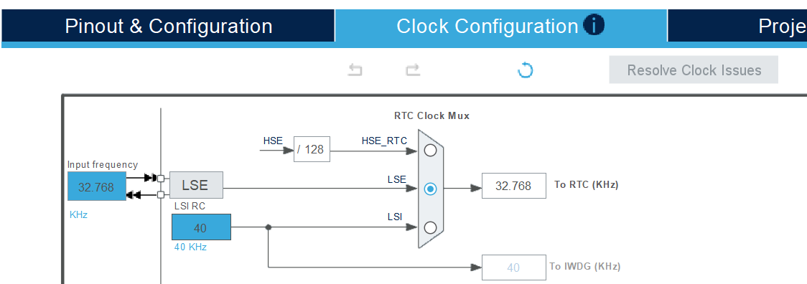

##### RTC驱动文件

还是基于江协的源码修改

修改CUBEMX帮我们生成的rtc.c中的初始化函数（其实一开始我是想把初始化在我自己的驱动文件myrtc.c里面写的，但是发现断电后时间没有被正确保存。结果发现是CUBEMX自动帮我们生成的初始化代码自带了重置时间为默认值的功能，所以为了时间不受到掉电重新上电的影响我们需要直接修改逻辑。

代码首先读取指定的后备寄存器（RTC_BKP_DR1）中的标志值（0xA5A5），以此判断RTC是否为首次上电运行。若读取值不匹配，则说明是首次启动或后备域丢失，此时会执行完整的初始化流程：设置用户指定的初始时间（2026年2月26日21:32:00）、开启秒中断，并将时间日期以及标志位（0xA5A5）写入后备寄存器中保存。若读取值匹配，则说明RTC已在运行且上次关机时保存了时间参数，代码会直接从后备寄存器中读出之前保存的日期数据，并重新设置到RTC（主要是为了恢复日期相关的寄存器状态），同时再次开启秒中断。这样就确保了每次上电时，RTC不会因CubeMX默认代码而重置为编译时的默认值，而是根据后备寄存器的标志状态，要么执行一次性的初始化，要么恢复之前保存的配置，从而实现了断电后时间的持续保持功能。

###### 修改rtc.c文件

我原先是在我自己创建的myrtc.c文件里写的初始化函数，结果发现复位后时间被设置到0：0：0了，我仔细检查了配置和代码，最后发现是CUBEMX自动生成的初始化函数里面会无判断的自动设置时间为默认值。

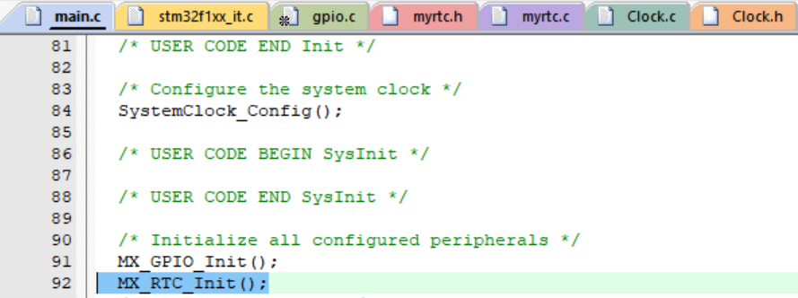

至于解决方法在江协教程中已经讲解过了，那就是在第一次上电的时候去写备份寄存器，后续每次上电都去判断这个寄存器的值，如果设置过值就不执行赋值时间为初试设置值的代码了。

```
思路上：
if(备份寄存器的值不为A5A5){
   //第一次会走这里
   赋值时间结构体各个值为设置的初始时间
   写备份寄存器为A5A5
}
//之后主电源掉电再上电就走这里了
```

###### rtc.c修改

主要就是实现上面这个逻辑，然后对应的后备区时钟开启等操作也要进行一下，这个和江协的初始化函数逻辑是差不多的

```
/* RTC init function */
void MX_RTC_Init(void)
{

  /* USER CODE BEGIN RTC_Init 0 */
  RTC_TimeTypeDef time;   // 时间结构体参数
  RTC_DateTypeDef datebuff;   // 日期结构体参数
  /* USER CODE END RTC_Init 0 */

  RTC_TimeTypeDef sTime = {0};
  RTC_DateTypeDef DateToUpdate = {0};

  /* USER CODE BEGIN RTC_Init 1 */
  __HAL_RCC_BKP_CLK_ENABLE();       // 开启后备区域时钟
  __HAL_RCC_PWR_CLK_ENABLE();       // 开启电源时钟
  /* USER CODE END RTC_Init 1 */

  /** Initialize RTC Only
  */
  hrtc.Instance = RTC;
  hrtc.Init.AsynchPrediv = RTC_AUTO_1_SECOND;
  if (HAL_RTC_Init(&hrtc) != HAL_OK)
  {
    Error_Handler();
  }

  /* USER CODE BEGIN Check_RTC_BKUP */
  // 检查备份寄存器，判断是否为首次上电
  if (HAL_RTCEx_BKUPRead(&hrtc, RTC_BKP_DR1) != 0xA5A5)
  {
    /* USER CODE END Check_RTC_BKUP */

    /** Initialize RTC and set the Time and Date
    */
    // 首次上电，设置初始时间
    sTime.Hours = 21;       // 21点
    sTime.Minutes = 32;     // 32分
    sTime.Seconds = 0;      // 0秒

    if (HAL_RTC_SetTime(&hrtc, &sTime, RTC_FORMAT_BIN) != HAL_OK)
    {
      Error_Handler();
    }
    
    DateToUpdate.WeekDay = 4;    // 星期四 (通常1=星期一, 2=星期二, 3=星期三, 4=星期四)
    DateToUpdate.Month = 2;       // 二月
    DateToUpdate.Date = 26;       // 26日
    DateToUpdate.Year = 26;       // 2026年 (表示年份的后两位)

    if (HAL_RTC_SetDate(&hrtc, &DateToUpdate, RTC_FORMAT_BIN) != HAL_OK)
    {
      Error_Handler();
    }
    
    /* USER CODE BEGIN RTC_Init 2 */
    // 开启RTC时钟秒中断
    __HAL_RTC_SECOND_ENABLE_IT(&hrtc, RTC_IT_SEC);
    
    // 保存日期数据到备份寄存器
    datebuff = DateToUpdate;  // 把日期数据拷贝到自己定义的data中
    
    // 向后备区域寄存器写入数据，标记已初始化
    HAL_RTCEx_BKUPWrite(&hrtc, RTC_BKP_DR1, 0xA5A5);
    HAL_RTCEx_BKUPWrite(&hrtc, RTC_BKP_DR2, (uint16_t)datebuff.Year);
    HAL_RTCEx_BKUPWrite(&hrtc, RTC_BKP_DR3, (uint16_t)datebuff.Month);
    HAL_RTCEx_BKUPWrite(&hrtc, RTC_BKP_DR4, (uint16_t)datebuff.Date);
    HAL_RTCEx_BKUPWrite(&hrtc, RTC_BKP_DR5, (uint16_t)datebuff.WeekDay);
    /* USER CODE END RTC_Init 2 */
  }
  else
  {
    /* USER CODE BEGIN RTC_Init 2 */
    // 非首次上电，从备份寄存器读取之前保存的日期数据
    datebuff.Year    = HAL_RTCEx_BKUPRead(&hrtc, RTC_BKP_DR2);
    datebuff.Month   = HAL_RTCEx_BKUPRead(&hrtc, RTC_BKP_DR3);
    datebuff.Date    = HAL_RTCEx_BKUPRead(&hrtc, RTC_BKP_DR4);
    datebuff.WeekDay = HAL_RTCEx_BKUPRead(&hrtc, RTC_BKP_DR5);
    
    // 恢复日期设置
    DateToUpdate = datebuff;
    if (HAL_RTC_SetDate(&hrtc, &DateToUpdate, RTC_FORMAT_BIN) != HAL_OK)
    {
      Error_Handler();
    }
    
    // 开启RTC时钟秒中断
    __HAL_RTC_SECOND_ENABLE_IT(&hrtc, RTC_IT_SEC);
    /* USER CODE END RTC_Init 2 */
  }
  
/* USER CODE BEGIN RTC_Init 2 */
	
/* USER CODE END RTC_Init 2 */
}
```

然后就是我们自己的驱动文件，rtc初始化代码在rtc.c里面已经实现过了，我们自己的驱动文件就写一下设置时间和读取时间的代码就好。

这里的实现逻辑就是读写时间结构体然后通过HAL_RTC_SetTime（） 、HAL_RTC_SetDate（）、HAL_RTC_GetTime（）、HAL_RTC_GetDate()去把结构体往RTC硬件寄存器读或写。

###### myrtc.h

```
#ifndef __MYRTC_H
#define __MYRTC_H

#include "stm32f1xx_hal.h"  // 修改标准库→HAL库头文件

extern uint16_t MyRTC_Time[];//年月日时分秒

void MyRTC_SetTime(void);
void MyRTC_ReadTime(void);

#endif
```

###### myrtc.c

```
#include "myrtc.h"      
#include <time.h>

extern RTC_HandleTypeDef hrtc;  // 添加CubeMX生成的RTC句柄
uint16_t MyRTC_Time[6];

//初始化代码在CUBEMX生成的rtc.c文件的MX_RTC_Init()函数中

void MyRTC_SetTime(void)
{
    time_t time_cnt;
    struct tm time_date;
    RTC_TimeTypeDef sTime = {0};   // HAL库时间结构体，用于设置时分秒
    RTC_DateTypeDef sDate = {0};   // HAL库日期结构体，用于设置年月日
    
    // 从MyRTC_Time数组获取时间数据
    time_date.tm_year = MyRTC_Time[0]-1900;
    time_date.tm_mon = MyRTC_Time[1]-1;
    time_date.tm_mday = MyRTC_Time[2];
    time_date.tm_hour = MyRTC_Time[3];
    time_date.tm_min = MyRTC_Time[4];
    time_date.tm_sec = MyRTC_Time[5];
    
    // 转换为时间戳
    time_cnt = mktime(&time_date);
    
    // 将UTC时间戳转换回tm结构体
    time_date = *localtime(&time_cnt);
    
    // 填充HAL库时间结构体
    sTime.Hours = time_date.tm_hour;
    sTime.Minutes = time_date.tm_min;
    sTime.Seconds = time_date.tm_sec;
    
    // 填充HAL库日期结构体（HAL年份=tm_year-100，因为HAL以2000年为基准）
    sDate.Year = time_date.tm_year - 100;
    sDate.Month = time_date.tm_mon + 1;
    sDate.Date = time_date.tm_mday;
    
    // HAL库函数：设置RTC时间和日期（Binary格式，与CubeMX配置一致）
    HAL_RTC_SetTime(&hrtc, &sTime, RTC_FORMAT_BIN);
    HAL_RTC_SetDate(&hrtc, &sDate, RTC_FORMAT_BIN);
    
    // 删除：HAL库函数内部已包含等待操作完成的机制
    // RTC_WaitForLastTask();
}

void MyRTC_ReadTime(void)
{
    time_t time_cnt;
    struct tm time_date;
    RTC_TimeTypeDef sTime = {0};   // HAL库时间结构体，用于接收时分秒
    RTC_DateTypeDef sDate = {0};   // HAL库日期结构体，用于接收年月日
    
    // HAL库函数：从RTC读取时间和日期（Binary格式）
    HAL_RTC_GetTime(&hrtc, &sTime, RTC_FORMAT_BIN);
    HAL_RTC_GetDate(&hrtc, &sDate, RTC_FORMAT_BIN);
    
    // 将HAL库结构体转换为tm结构体
    time_date.tm_year = sDate.Year + 100;  // HAL年份+100 = tm_year
    time_date.tm_mon = sDate.Month - 1;
    time_date.tm_mday = sDate.Date;
    time_date.tm_hour = sTime.Hours;
    time_date.tm_min = sTime.Minutes;
    time_date.tm_sec = sTime.Seconds;
    
    // 转换为时间戳
    time_cnt = mktime(&time_date);
    time_date = *localtime(&time_cnt);
    
    // 更新MyRTC_Time数组供应用程序使用
    MyRTC_Time[0] = time_date.tm_year + 1900;
    MyRTC_Time[1] = time_date.tm_mon + 1;
    MyRTC_Time[2] = time_date.tm_mday;
    MyRTC_Time[3] = time_date.tm_hour;
    MyRTC_Time[4] = time_date.tm_min;
    MyRTC_Time[5] = time_date.tm_sec;
}
```

配置完之后编译一下，我发现一个奇妙的事情就是PC13变成常亮了！

这应该是引脚冲突了，直接看看CUBEMX的图形配置界面，果不其然PC13是RTC的输出引脚


奥，这个时候我才注意到上面基础配置是可以选择不作为RTC输出的


重新生成一下工程，运行代码可以发现一切正常了

## ⚙️ 任务封装（APP文件夹）

#### UI界面-启动动画

###### startup_animation.h

```c
#ifndef __STARTUP_ANIMATION_H
#define __STARTUP_ANIMATION_H

#include <stdint.h>
#include "FreeRTOS.h"
#include "task.h"

//==============================================================================
// 开机动画函数声明（FreeRTOS版本）
//==============================================================================

// 动画任务函数
void vTaskStartupAnimation(void *pvParameters);

// 动画子函数
void vAnimation_Typewriter(void);
void vAnimation_LoadingBar(void);

// 创建动画任务（供main调用）
BaseType_t xCreateStartupAnimationTask(UBaseType_t uxPriority);

// 等待动画完成的标志（可选，用于同步）
extern volatile BaseType_t xAnimationCompleted;

#endif /* __STARTUP_ANIMATION_H */
```

###### startup_animation.c

```c
#include "startup_animation.h"
#include "oled.h"
#include "oled_fonts.h"
#include <string.h>
#include <stdio.h>
#include "FreeRTOS.h"
#include "task.h"

// 动画完成标志（可选）
volatile BaseType_t xAnimationCompleted = pdFALSE;

//开机动画任务函数

void vTaskStartupAnimation(void *pvParameters)
{
    // 先显示测试信息，确认任务运行
    OLED_Clear();
    OLED_ShowString_Center(24, "Animation Start", 8);
    OLED_Update();
    vTaskDelay(pdMS_TO_TICKS(500));
    
    // 1. 打字机效果显示 "2G XIAOHEI"
    vAnimation_Typewriter();
    
    // 2. 加载进度条动画
    vAnimation_LoadingBar();
    
    // 设置完成标志
    xAnimationCompleted = pdTRUE;
    
    // 动画完成后删除自己
    vTaskDelete(NULL);  // 删除自己
}

//打字机效果显示文字 "2G XIAOHEI"

void vAnimation_Typewriter(void)
{
    char *text = "2G XIAOHEI";
    uint8_t len = strlen(text);
    uint8_t i;
    uint8_t startX;
    uint8_t startY;
    
    OLED_Clear();
    OLED_Update();
    
    // 使用8x16字体
    startX = (128 - (len * 8)) / 2;
    startY = 24;
    
    // 逐个字符显示，实现打字机效果
    for (i = 0; i < len; i++)
    {
        OLED_ShowChar(startX + i * 8, startY, text[i], 8);
        OLED_Update();
        vTaskDelay(pdMS_TO_TICKS(200));
    }
    
    vTaskDelay(pdMS_TO_TICKS(500));
}

//加载进度条动画

void vAnimation_LoadingBar(void)
{
    uint8_t progress;
    char percent[4];
    uint8_t loadingX, percentX;
    
    OLED_Clear();
    OLED_Update();
    
    // 显示"LOADING"文字
    loadingX = (128 - (7 * 8)) / 2;  // "LOADING"共7个字符
    OLED_ShowString(loadingX, 16, "LOADING", 8);
    OLED_Update();
    vTaskDelay(pdMS_TO_TICKS(100));
    
    // 进度条外框
    OLED_DrawRectangle(24, 36, 80, 10, 0);
    OLED_Update();
    vTaskDelay(pdMS_TO_TICKS(100));
    
    // 进度条动画
    for (progress = 0; progress <= 100; progress += 5)
    {
        // 显示百分比
        sprintf(percent, "%d%%", progress);
        percentX = (128 - (strlen(percent) * 8)) / 2;
        OLED_ShowString(percentX, 50, percent, 8);
        
        // 绘制进度
        if (progress > 0)
        {
            OLED_FillArea(26, 38, (76 * progress) / 100, 6, 1);
        }
        
        OLED_Update();
        vTaskDelay(pdMS_TO_TICKS(100));
    }
    
    vTaskDelay(pdMS_TO_TICKS(500));
}

//创建开机动画任务

BaseType_t xCreateStartupAnimationTask(UBaseType_t uxPriority)
{
    BaseType_t xReturn;
    TaskHandle_t xHandle = NULL;
    
    xReturn = xTaskCreate(
        vTaskStartupAnimation,      // 任务函数
        "Animation",                // 任务名称
        256,                        // 堆栈大小（字）- 根据实际需要调整
        NULL,                       // 任务参数
        uxPriority,                 // 优先级
        &xHandle                    // 任务句柄
    );
    
    return xReturn;
}
```

###### 任务测试

现在我们有两个任务一个是移植测试程序里面写好的小灯闪烁一个是开机动画。

比如我们把LED当成开机后的主程序，则可以配置开机动画到更高优先级（这里注意FreeRTOS的任务优先级是数值越大优先级越高，这点和STM32的NVIC中断优先级是相反的）

```c
// 创建开机动画任务（高优先级，优先级为2）
xCreateStartupAnimationTask(2)

// 创建LED闪烁任务（低优先级，优先级为1）  
xTaskCreate(vLEDTask, "LED", 128, NULL, 1, &xLEDTaskHandle)
```

但是这个时候开始调度会发现小灯闪烁和动画显示几乎是同时在发生的？奇怪，操作系统里面学过，高优先级的任务运行完才能轮到低优先级的任务啊，同优先级才可能轮转，这下两个优先级不同的任务咋还同时运行了呢？

啊！这是因为我们在开机动画的任务函数里面调用了多次vTaskDelay函数

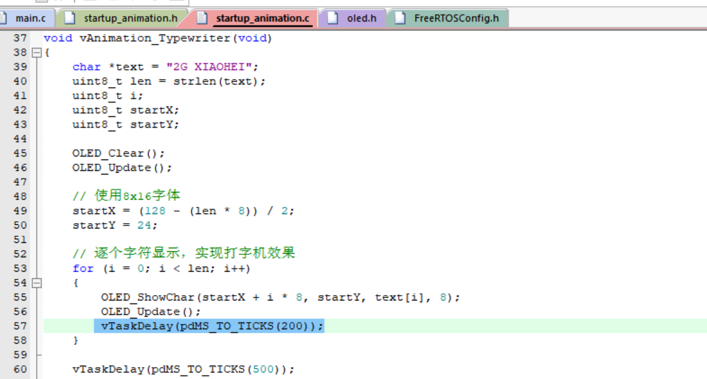

根据FreeRTOS的任务调度机制，当高优先级的动画任务调用`vTaskDelay()`进入阻塞态后，该任务会从就绪列表中移除，此时调度器会重新进行任务调度，从当前就绪的任务中选择优先级最高的任务执行。由于动画任务已不在就绪态，原本优先级较低（优先级1）的LED闪烁任务成为就绪队列中的最高优先级任务，因此被调度器选中获得CPU使用权开始执行。当动画任务的延时时间到达后，它从阻塞态返回就绪态，但由于其优先级（优先级2）高于当前运行的LED任务，调度器会立即触发任务抢占，暂停LED任务的执行，将CPU资源重新分配给动画任务。这种高优先级任务通过主动阻塞让出CPU，使得低优先级任务获得执行机会，待高优先级任务重新就绪后又立即抢占的机制，在宏观上形成了两个任务交替执行、看起来像是同时运行的效果。

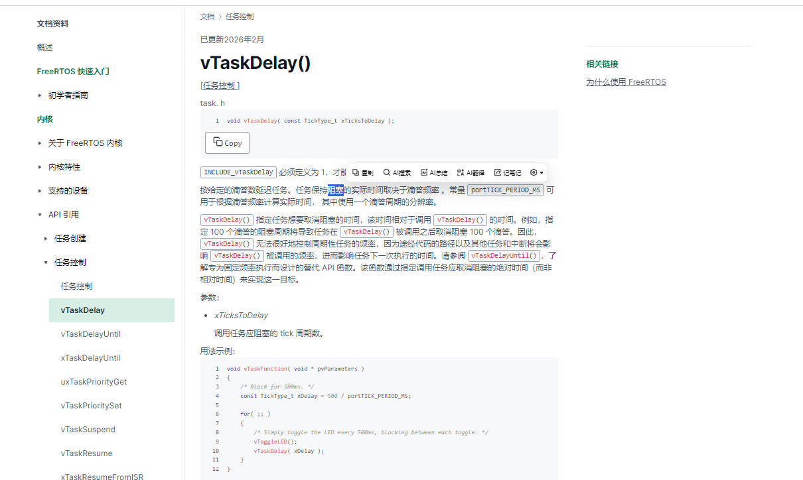

我尝试把动画函数里面的vTaskDelay()改成Hal_Delay()，后者是死等，任务不会退出运行队列死死占着CPU不让，那低优先级的任务也就只有干等了。而实际的实验情况也确实是这样，动画放送完毕小灯才得到闪烁自己的机会。

悟，那要是我希望小灯等动画播放完才能闪烁咋办？第一直觉当然是把动画任务里面的vTaskDelay()改成Hal_Delay()，但这种改法通用性差，开机动画任务函数最后我是让任务函数自杀掉的

```c
    // 动画完成后删除自己
    vTaskDelete(NULL);  // 删除自己
```

万一后面我要写些优先级高还要一直运行的任务，就可能导致低优先级的任务饿死。

那咋办呢？带着操作系统期末考试的记忆，我想起了一个叫做PV操作的东东（P是等待，V是发送）的东西，我可以设计一个二值信号量来控制任务的运行顺序。

```
信号量 S = 0  

动画{             
   //播放开机动画
   V(S)            // S = 1，若有阻塞则唤醒线程B
}

小灯闪烁{          // 线程B
   P(S)            // S = 0-1 = -1，阻塞等待
   //小灯闪烁
}
```

综上，可以补全一下程序了。上面信号量的设计中的这个二值信号量startup_animation.h文件外部声明的这个 xAnimationCompleted。

```c
// 等待动画完成的标志（可选，用于同步）
extern volatile BaseType_t xAnimationCompleted;
```

###### FreeRTOSConfig.h

保持移植测试程序的文件内容即可

###### main.c

```c
/* USER CODE BEGIN Includes */
#include "FreeRTOS.h"
#include "startup_animation.h"
#include "oled.h"
/* USER CODE END Includes */

/* USER CODE BEGIN PV */
TaskHandle_t xLEDTaskHandle = NULL;
/* USER CODE END PV */

/* USER CODE BEGIN PFP */
void vLEDTask(void *pvParameters);
/* USER CODE END PFP */

/* USER CODE BEGIN 2 */
 // 初始化OLED
    OLED_Init();
    OLED_Clear();
    
    // 创建开机动画任务（高优先级，让动画先运行）
    if (xCreateStartupAnimationTask(2) != pdPASS)
    {
        // 创建失败处理
        OLED_ShowString(0, 0, "Anim Fail!", 8);
        OLED_Update();
    }
    
    // 创建LED闪烁任务（低优先级）
    xTaskCreate(
        vLEDTask,
        "LED",
        128,
        NULL,
        1,
        &xLEDTaskHandle
    );
    
    // 启动调度器
    vTaskStartScheduler();
  /* USER CODE END 2 */

/* USER CODE BEGIN 4 */
//LED闪烁任务
void vLEDTask(void *pvParameters)
{
    // 等待动画完成(可选)
    while (xAnimationCompleted == pdFALSE)
    {
        vTaskDelay(pdMS_TO_TICKS(10));
    }
    
    while (1)
    {
        HAL_GPIO_TogglePin(GPIOC, GPIO_PIN_13);
        vTaskDelay(pdMS_TO_TICKS(500));
    }
}
/* USER CODE END 4 */
```

如果不想用这个PV操作的同步操作的话，把main.c这部分代码注释掉即可（要再彻底的话那就把信号量一起删掉）。

```c
    // 等待动画完成(可选)
    while (xAnimationCompleted == pdFALSE)
    {
        vTaskDelay(pdMS_TO_TICKS(10));
    }
```

---

#### UI界面-简单时钟显示

把上面的rtc驱动文件和OLED显示文件整合成一个简单的时间显示界面

###### Clock.h

```
#ifndef __CLOCK_H
#define __CLOCK_H

/* 包含头文件 */
#include "FreeRTOS.h"
#include "task.h"

//任务句柄声明
extern TaskHandle_t RTC_Display_Handle;

/* 任务函数声明 */
void Task_RTC_Display(void *argument);

/* 任务创建函数声明 */
void Clock_Task_Init(void);

#endif /* __CLOCK_H */
```

###### Clock.c

```
#include "Clock.h"
#include "myrtc.h"    
#include "oled.h"

/* 定义任务句柄 */
TaskHandle_t RTC_Display_Handle = NULL;

//动画完成标志的外部引用(用于同步）
extern volatile uint8_t xAnimationCompleted;

//RTC显示任务函数
void Task_RTC_Display(void *argument)
{
    /* 等待开机动画完成 */
    while (xAnimationCompleted == pdFALSE)
    {
        vTaskDelay(pdMS_TO_TICKS(10));
    }
    
    /* 无限循环 - 显示时间 */
    while (1)
    {
        // 读取当前RTC时间
        MyRTC_ReadTime();
        
        // 清屏
        OLED_Clear();
        
        // 第1行 (Y=1) - 显示年月日
        OLED_ShowString(1, 1, "Date:", 8);                    // 列1: "Date:"
        OLED_ShowNum(1 + 6 * 8, 1, MyRTC_Time[0], 4, 8);      // 列49: 年
        OLED_ShowString(1 + 10 * 8, 1, "-", 8);               // 列81: "-"
        OLED_ShowNum(1 + 11 * 8, 1, MyRTC_Time[1], 2, 8);     // 列89: 月
        OLED_ShowString(1 + 13 * 8, 1, "-", 8);               // 列105: "-"
        OLED_ShowNum(1 + 14 * 8, 1, MyRTC_Time[2], 2, 8);     // 列113: 日
        
        // 第2行 (Y=1+16=17) - 显示时分秒
        OLED_ShowString(1, 17, "Time:", 8);                   // 列1: "Time:"
        OLED_ShowNum(1 + 6 * 8, 17, MyRTC_Time[3], 2, 8);     // 列49: 时
        OLED_ShowString(1 + 8 * 8, 17, ":", 8);               // 列65: ":"
        OLED_ShowNum(1 + 9 * 8, 17, MyRTC_Time[4], 2, 8);     // 列73: 分
        OLED_ShowString(1 + 11 * 8, 17, ":", 8);              // 列89: ":"
        OLED_ShowNum(1 + 12 * 8, 17, MyRTC_Time[5], 2, 8);    // 列97: 秒
        
        // 更新OLED显示
        OLED_Update();
        
        // 延时1秒
        vTaskDelay(pdMS_TO_TICKS(1000));
    }
}

//时钟任务初始化函数
void Clock_Task_Init(void)
{
    /* 创建RTC显示任务 */
    xTaskCreate(
        Task_RTC_Display,       // 任务函数
        "RTC_Display",          // 任务名称
        256,                    // 任务堆栈大小（根据实际需求调整）
        NULL,                   // 任务参数
        1,                      // 任务优先级（与LED相同）
        &RTC_Display_Handle     // 任务句柄
    );
}
```

###### 任务测试3

###### FreeRTOSConfig.h

保持移植测试程序的文件内容即可

###### main.c

添加头文件，添加任务即可

```
/* USER CODE BEGIN Includes */
#include "FreeRTOS.h"
#include "startup_animation.h"
#include "oled.h"
#include "Clock.h"
/* USER CODE END Includes */

/* USER CODE BEGIN PV */
TaskHandle_t xLEDTaskHandle = NULL;
/* USER CODE END PV */

/* USER CODE BEGIN PFP */
void vLEDTask(void *pvParameters);
/* USER CODE END PFP */

  /* USER CODE BEGIN 2 */
 // 初始化OLED
    OLED_Init();
    OLED_Clear();
    
    // 创建开机动画任务（高优先级，让动画先运行）
    if (xCreateStartupAnimationTask(2) != pdPASS)
    {
        // 创建失败处理
        OLED_ShowString(0, 0, "Anim Fail!", 8);
        OLED_Update();
    }
    
    // 创建LED闪烁任务（低优先级）
    xTaskCreate(
        vLEDTask,
        "LED",
        128,
        NULL,
        1,
        &xLEDTaskHandle
    );
		//创建时钟显示任务
    Clock_Task_Init();
    // 启动调度器
    vTaskStartScheduler();
  /* USER CODE END 2 */
  
  /* USER CODE BEGIN 4 */
//LED闪烁任务
void vLEDTask(void *pvParameters)
{
    // 等待动画完成
    while (xAnimationCompleted == pdFALSE)
    {
        vTaskDelay(pdMS_TO_TICKS(10));
    }
    while (1)
    {
        HAL_GPIO_TogglePin(GPIOC, GPIO_PIN_13);
        vTaskDelay(pdMS_TO_TICKS(500));
    }
}
/* USER CODE END 4 */
```

###### 任务间问题

预期现象是播放动画然后显示时钟界面的同时小灯闪烁，但是我发现程序会卡在进度条这个动画，去掉进度条一切符合预期

```
//加载进度条动画

void vAnimation_LoadingBar(void)
{
//…… 
    // 进度条动画
    for (progress = 0; progress <= 100; progress += 5)
    {
        // 显示百分比
        sprintf(percent, "%d%%", progress);
        percentX = (128 - (strlen(percent) * 8)) / 2;
        OLED_ShowString(percentX, 50, percent, 8);
        
        // 绘制进度
        if (progress > 0)
        {
            OLED_FillArea(26, 38, (76 * progress) / 100, 6, 1);
        }
        
        OLED_Update();
        vTaskDelay(pdMS_TO_TICKS(100));
    }
    
//……
}
```

